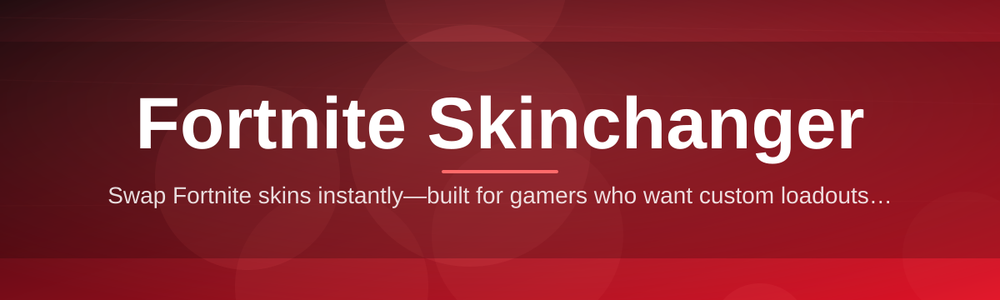
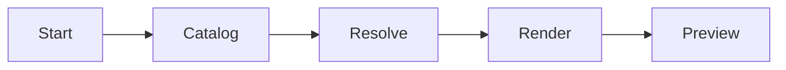

# fortnite-skin-editor 🎨🦄

  

*A friendly, community-built Fortnite Skinchanger for tinkering with your locker preview, offline and on your own terms.*

  

> [!NOTE]
> **TL;DR**
> - 🎨 `fortnite-skin-editor` is an open-source Fortnite Skinchanger that lets you preview and swap cosmetic loadouts in a lightweight desktop app.
> - 🧩 No dependencies, no clutter — download one build, run it, and start experimenting with skins, backblings, and pickaxes.
> - 🤝 Built in the open with a real roadmap and an active discussions board — contributors and idea-droppers are always welcome.

## 🧵 Overview

Let's start with the "why." Every Fortnite season drops a fresh wave of skins, and most players end up with a locker full of items they rarely get to actually *look at* before jumping into a match. `fortnite-skin-editor` was born out of a simple itch: wanting a calm, dedicated space to browse, preview, and arrange cosmetics without the pressure of a live lobby countdown. It's a Fortnite Skinchanger in the truest sense of the phrase — a focused utility, not a bloated launcher, not a bundled toolbox of unrelated features.

The project targets a very specific kind of user: the tinkerer. Maybe you're a content creator lining up thumbnail-worthy combos, a completionist who wants to admire a rare vault skin one more time, or just someone who enjoys the aesthetic side of Fortnite as much as the competitive one. Whatever your reason, the app gives you a clean canvas — a preview pane, a searchable cosmetic list, and simple controls — so you can focus on the fun part: mixing and matching.

Under the hood, we've kept things intentionally simple. No background services, no telemetry you didn't ask for, and no hidden processes running after you close the window. It's a standalone Windows application that respects your time and your PC. That philosophy — small, transparent, community-reviewed — is what keeps this repository alive season after season.

---

## 🧰 What's In The Toolbox

Here's a tour of what `fortnite-skin-editor` actually does, told through the angle that matters most for each feature:

- **Live locker preview** — see cosmetic combinations rendered in a rotating 3D-style viewer before you commit to anything, no guesswork required.

- **Cosmetic search & filters** — a fast, fuzzy search bar lets you jump straight to "that one skin from Chapter 3" instead of scrolling forever.

- **Style variant switching** — many skins ship with alternate styles or colorways; toggle between them instantly to compare side by side.

- **Backbling & pickaxe pairing** — mix cosmetic slots freely to build combos that actually work visually together, not just what the game defaults to.

- **Season-aware catalog** — the item catalog is structured by season and rarity, so nostalgia-diving through older Battle Passes is effortless.

- **Lightweight rendering engine** — built to run smoothly even on modest hardware, because previewing skins shouldn't need a gaming rig.

- **Local-only operation** — everything happens on your machine; there's no account linking, no server round-trips for the core preview flow.

- **Custom favorites list** — pin your go-to combos so you're not re-searching the same skin every time you open the app.

> [!TIP]
> Use the favorites list to build a "rotation" of combos for different vibes — competitive, aesthetic, meme — and switch between them in seconds.

---

## 🚀 How To Get Started

Getting up and running takes about two minutes:

1. **Visit the landing page** using the download button above (or below).

2. **Grab the latest build** — it's a single standalone package, no installer wizard needed.

3. **Run the executable** — Windows may show a SmartScreen prompt for new/unsigned apps; click "More info" → "Run anyway" if you trust the source.

4. **Open the locker view** and start exploring — search, preview, and save your favorite combinations.

> [!IMPORTANT]
> Always download builds from the official landing page linked in this README. Third-party mirrors are not maintained by this project and cannot be verified.

---

## 💻 System Requirements

| Requirement | Details |
|---|---|
| OS | Windows 10 or Windows 11 (64-bit) |
| Dependencies | None — fully standalone |
| Storage | ~150 MB free space |
| RAM | 4 GB minimum, 8 GB recommended |
| GPU | Any DirectX 11-capable GPU |
| Internet | Only needed for downloading the build |

  

---

## ⚙️ How It Works

The internal flow is intentionally straightforward — a short pipeline from catalog data to what you see on screen:

1. **Catalog load** — cosmetic metadata (names, rarities, seasons, styles) is parsed on launch.
2. **Asset resolve** — the app matches each catalog entry to its local preview asset.
3. **Render pass** — the selected skin/backbling/pickaxe combo is composed in the viewer.
4. **User interaction** — search, filter, and swap trigger a quick re-render, not a full reload.
5. **Save state** — favorites and last-used combos are stored locally for next time.

> [!NOTE]
> The render pass is decoupled from the catalog loader, which is why switching styles feels instant even on larger seasonal catalogs.

---

## 🩹 Troubleshooting

<strong>The app won't launch after downloading — what now?</strong>

Make sure you didn't extract only part of the package if it came zipped. Also confirm you're running a supported Windows version (10/11, 64-bit). Right-click → "Run as administrator" can resolve permission-related launch failures.

<strong>Windows SmartScreen is blocking the executable.</strong>

This is expected for newer, community-signed builds. Click "More info," then "Run anyway." We're working on broader code-signing as the project grows — see the roadmap in Discussions.

<strong>Some skins show up as a generic placeholder icon.</strong>

This usually means the local asset cache hasn't fully synced for that item yet, often right after a new season's catalog update. Give it a moment or reopen the app.

<strong>The preview viewer feels sluggish.</strong>

Lower the render quality in Settings → Display, and close other GPU-heavy apps running in the background. The viewer is lightweight but still uses your GPU for smooth rotation.

<strong>Can this be used while Fortnite itself is running?</strong>

Yes — `fortnite-skin-editor` operates entirely independently of the game client. It's a standalone preview tool, not a game modification.

<strong>My favorites list disappeared after an update.</strong>

Favorites are stored in a local config file. If you moved or reinstalled the app to a different folder, point Settings → Data Location back to your original config path.

---

## 🎛️ UI, UX & Little Comforts

We spent real effort making the day-to-day feel pleasant:

- **Themes** — Light, Dark, and an OLED-friendly "Midnight Locker" theme.
- **Keyboard shortcuts**:

| Shortcut | Action |
|---|---|
| `Ctrl + F` | Focus search bar |
| `Ctrl + S` | Save current combo to favorites |
| `Arrow Keys` | Rotate preview |
| `Ctrl + ,` | Open Settings |
| `Esc` | Clear active filters |

- **Adjustable render quality** — trade fidelity for FPS on lower-end machines.
- **Season filter chips** — one click to isolate a specific Battle Pass era.
- **Persistent window state** — reopens exactly where you left it, including active filters.

> [!TIP]
> Pair `Ctrl + F` with the season filter chips to narrow a search down to seconds instead of scrolling through hundreds of entries.

---

## 🤝 Contributing & Community

This project only exists because people show up for it. Whether you write code, file detailed bug reports, or just chime in with a good idea in Discussions — you're part of the reason `fortnite-skin-editor` keeps improving.

- 🗺️ **Roadmap** — check the pinned roadmap issue for what's planned next (theme packs, more season data, accessibility passes).
- 💬 **Discussions** — the best place for feature requests, "is this a bug?" checks, and general chat.
- 🐛 **Issues** — please include your Windows version and steps to reproduce; it saves everyone time.
- 🔧 **Pull Requests** — small, focused PRs get reviewed faster than sprawling ones. Say hi in Discussions first if it's a big change.

> [!WARNING]
> Please don't open PRs that add telemetry, bundled installers, or third-party ad SDKs. Keeping this tool lean and transparent is a core project value, not a suggestion.

---

## 📜 License

Released under the [MIT License](LICENSE), 2026. Use it, fork it, remix it — just keep the license notice intact.

---

## ⚠️ Disclaimer

`fortnite-skin-editor` is an independent, community-made project and is not affiliated with, endorsed by, or connected to Epic Games in any way. Fortnite is a trademark of Epic Games, Inc. This tool operates as a standalone cosmetic preview utility and does not modify game files or interact with live game sessions.

---

## 📝 Changelog

<strong>v2026.2 — "Midnight Locker"</strong>

- Added the Midnight Locker OLED-friendly dark theme
- Improved catalog load times by roughly 30%
- Fixed placeholder icons lingering after season updates
- New keyboard shortcut: `Ctrl + ,` for quick Settings access

<strong>v2026.1 — "Style Swap"</strong>

- Introduced style-variant toggling for multi-style skins
- Added season filter chips to the catalog view
- Performance pass on the render pipeline
- Community-requested favorites persistence fix